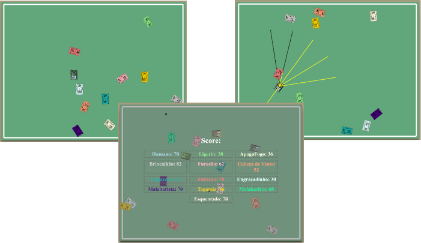
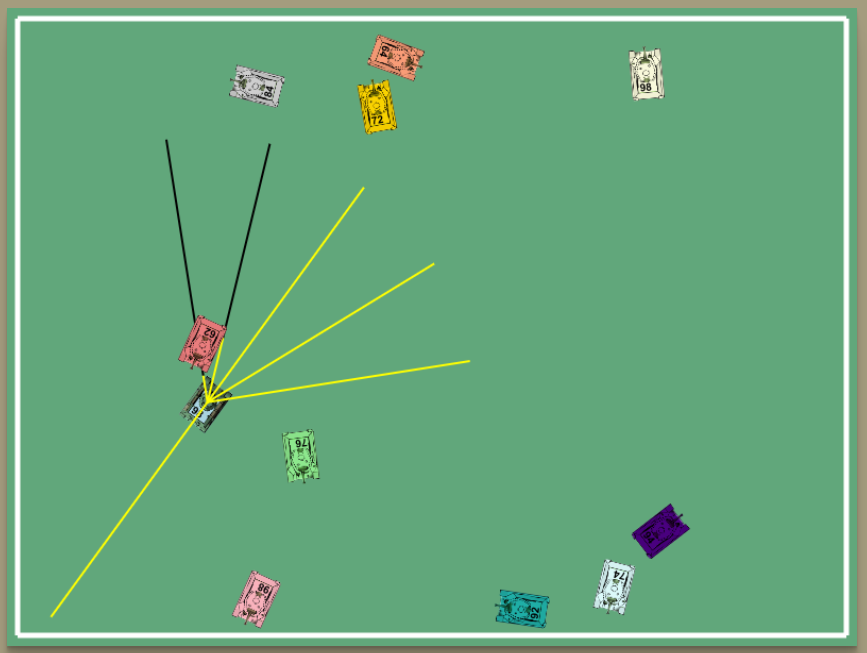

<div align="center">


## Prolog Tank Battle Project




</div>

---

## Menu
- [Prolog Tank Battle Project](#prolog-tank-battle-project)
- [Menu](#menu)
- [Introduction](#introduction)
- [Authors](#authors)
- [About the Project](#about-the-project)
- [Installation, Execution and Contribuition](#installation-execution-and-contribuition)

## Introduction

The Prolog Tank Battle Project is an interactive application exploring artificial intelligence concepts within a simulated tank combat environment. 

## Authors
This project is an extension of the [jeiks/batalha_tanques](https://github.com/jeiks/batalha_tanques) repository.

It is an academic work presented by Danilo José Lima de Oliveira to the course of Artificial Intelligence, taught by Professor Jacson Rodrigues Correia da Silva, as a partial requirement of the Computer Science course for Project 01 in the second semester of 2023.

## About the Project

The Prolog Tank Battle Project reimagines a traditional tank game by incorporating advanced Prolog programming to create intelligent, autonomous agents. These agents, equipped with virtual sensors, are capable of perceiving their environment and making strategic decisions. This project not only enhances the gameplay experience but also serves as a practical application of artificial intelligence principles. By integrating sensor data with Prolog's logical decision-making capabilities, each tank agent can navigate the battlefield, identify opponents, and tactically engage in combat, demonstrating a significant leap from basic pre-programmed behaviors to dynamic, adaptive strategies.

<p align="center"></p>

## Installation, Execution and Contribuition

Before starting, ensure you have SWI-Prolog installed on your system. This is crucial for running the Prolog-based agent within the tank battle simulation.

Step 1: *Install SWI-Prolog*

You can download SWI-Prolog from their official website. Follow the instructions relevant to your operating system.

Step 2: *Configure the Project*

After installing SWI-Prolog, you'll need to set up the project.

[main.js]('main.js'): This file controls the general settings of the game. You can configure aspects like the number of tanks, their speed, and other game parameters.

[servidor.pl](./servidor.pl): This file sets up the Prolog server. You'll need to ensure it is correctly configured to communicate with the game environment.

Step 3: *Edit the Agent*

To modify the agent's behavior, edit the [tanque0.pl](./tanque0.pl) file. This is where the decision-making logic of the tank agent is defined. Here's the core code of the agent:

Step 4: *Host the agent*

Run ```swipl -s servidor.pl``` at your terminal and watch the agent works by opening http://localhost:{YOUR_PORT} in your browser

*Additional Documentation*

Please note that the code and additional project documentation are available in Portuguese. For more detailed information, refer to [LEIA-ME.html](./LEIA-ME.html) and [Documentacao.md](/Documentacao.md).

---
